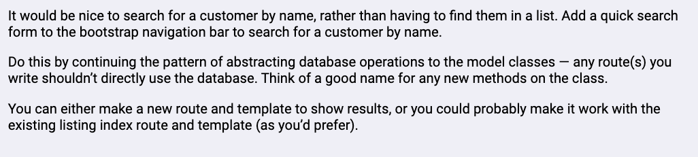
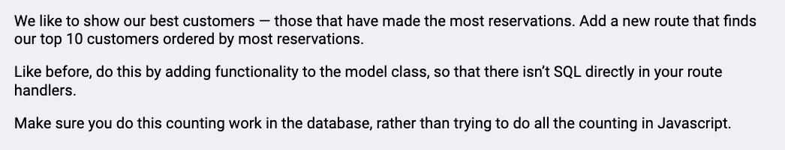

# This is a server-sided templated application with custom URLs. A majority of the source code was written by Springboard.

# I've enhanced functionality by adding these core components:

# Added search functionality for the requirements below. Key changes made included:

    - Added navigation item in template/base.html on line 39.

    - Added static function getCustomerID() to 'Customer' class in models/customer.js on line 73. 

    - Added /searchCustomers/ route on in route.sj line 32.

# Added 'Top 10 Customers' page for the requirements below. Key changes made included:

    - Added /top10/ route in routes.js file. 

    - Added navigation item in template/base.html on line 35. 

    - Added 'customer_list_top10.html' template under /templates to render the new page on route 'http://localhost:3000/top10/'. 

    - Added 'this.totalReservations' instance variable to the 'Customer' class. An instance variable was necessary since there was a need to calculate the total number of reservations per 'Customer' object.

# Additional enhancments:

     - Addeded .save() function to 'Reservation' class to enable adding reservations. Line 42 in models/reservations.js

     - Added .fullName() function to 'Customer' class to join first and last names by a space and updated templates to reference customer.fullName. This simplified the code.